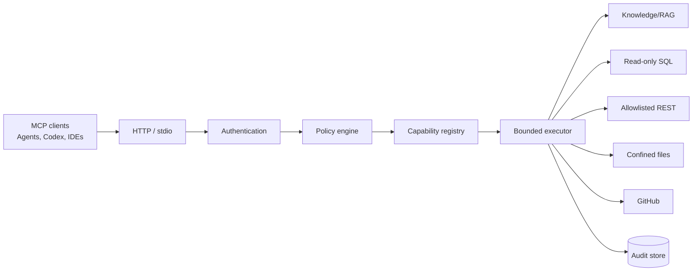

# Enterprise MCP Server

[](https://github.com/Kishan960615/enterprise-mcp-server/actions/workflows/ci.yml)
[](https://www.python.org/)
[](https://modelcontextprotocol.io/)
[](LICENSE)

A secure, multi-tenant Model Context Protocol server that gives AI clients controlled access to enterprise knowledge bases, SQL databases, REST APIs, files, and GitHub.

This is Project 3 in the Techne AI OSS portfolio and is designed to integrate with the Enterprise RAG Platform and Enterprise AI Agent Platform.

## What it demonstrates

- MCP tools, resources, and prompts over Streamable HTTP or stdio
- Authorization-filtered capability discovery and default-deny policies
- Enterprise RAG search with citations
- Parsed, bounded, read-only SQL
- Allowlisted REST operations
- Root-confined file search and reads
- Allowlisted GitHub file access at revisions
- Tenant-scoped, hash-chained audit records
- Typed plugin/registry contracts
- Health, metrics, Docker, CI, and adversarial tests

## Architecture



## Quick start

### Local Python

```bash
cp .env.example .env
uv sync --all-groups
uv run uvicorn enterprise_mcp.app:create_app --factory --reload
```

Open:

- MCP endpoint: `http://localhost:8000/mcp/`
- Health: `http://localhost:8000/health/ready`
- API documentation: `http://localhost:8000/docs`
- Metrics: `http://localhost:8000/metrics`

### Docker

```bash
docker compose up --build
```

The Compose demo includes PostgreSQL, Redis, the MCP server, a synthetic REST/knowledge service, and confined sample files. It does not require paid credentials.
The container endpoint is published at `http://localhost:8013` so it can run beside the other portfolio projects.

## Try the operational API

Development mode uses an explicit synthetic principal:

```bash
curl http://localhost:8000/api/v1/capabilities
curl http://localhost:8000/api/v1/audit/events
```

## MCP client configuration

```json
{
  "mcpServers": {
    "enterprise": {
      "url": "http://localhost:8000/mcp/"
    }
  }
}
```

Development mode is intentionally convenient. Production configuration refuses to start without OIDC settings and PostgreSQL.

## Built-in tools

| Tool | Purpose | Safety boundary |
|---|---|---|
| `system.capabilities` | List authorized capabilities | discovery filtered by policy |
| `knowledge.search` | Search enterprise knowledge | bounded results and citations |
| `sql.query` | Query a named SQL connection | parsed SELECT-only and row limits |
| `rest.request` | Call a named REST operation | no arbitrary URLs |
| `files.search` | Search an approved root | canonical root confinement |
| `files.read` | Read a bounded text range | size/range/path checks |
| `github.get_file` | Read an allowlisted repo file | repository allowlist and revision |

## Security model

- Verified identity creates tenant context; callers cannot supply a tenant argument.
- Capability discovery and invocation both enforce policy.
- R3/R4 operations cannot execute without an approval design; v1 tools are read-only.
- Arguments are fingerprinted for audit rather than stored raw.
- SQL, URL, file, result-size, timeout, and repository boundaries are independently enforced.
- Production rejects development authentication, SQLite, and wildcard CORS.

Read [SECURITY.md](SECURITY.md) and [docs/ARCHITECTURE.md](docs/ARCHITECTURE.md) for details.

## Development

```bash
make lint
make typecheck
make test-cov
```

## Repository layout

```text
src/enterprise_mcp/   application, MCP, security, connectors
tests/                unit, integration, MCP, security tests
docs/                 architecture, APIs, tool registry, implementation plan
deploy/               deployment assets
demo-data/            synthetic public fixtures
```

## Roadmap

- v0.1: protocol, connectors, policy, audit, Compose demo
- v0.2: persistent RBAC/connector administration and API keys
- v0.3: GitHub App installation authentication and plugin entry-point loader
- v0.4: OpenTelemetry collector and Kubernetes reference deployment
- v1.0: stable contracts, two-client compatibility, signed images and SBOM

## License

Apache-2.0
