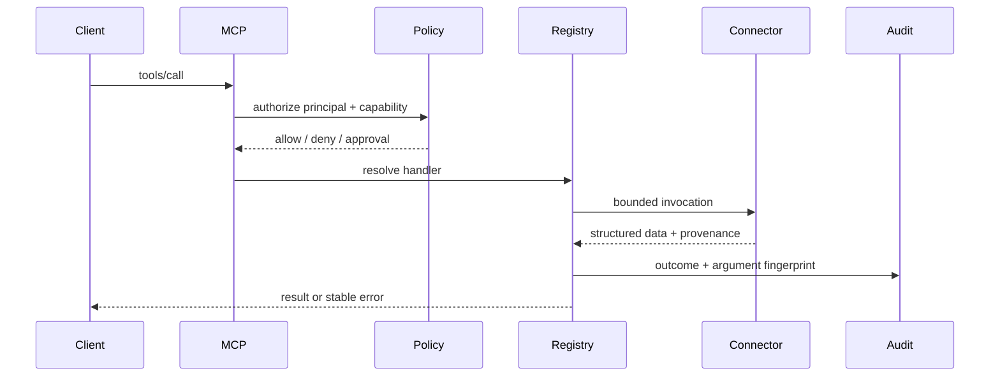

# Architecture

The server uses a thin FastMCP protocol adapter over framework-independent runtime services.

## Trust boundaries

1. Transport establishes an identity.
2. Identity supplies tenant context; tool arguments never do.
3. Policy filters discovery and invocation.
4. Registry maps fixed names to typed handlers.
5. Connectors enforce system-specific boundaries.
6. Audit records every terminal invocation outcome.

## Lifecycle

Startup validates settings, initializes telemetry, connects the database, creates the development schema, configures tools, then marks readiness true. Shutdown marks readiness false, drains MCP sessions, closes HTTP and SQL pools, and flushes persistence.

## Production evolution

The current repository is a complete runnable reference implementation. Before organization deployment, replace development schema creation with Alembic migration jobs, connect an OIDC auth provider directly to the MCP HTTP transport, use managed secrets, enforce network policies, and export audit records to immutable storage.
